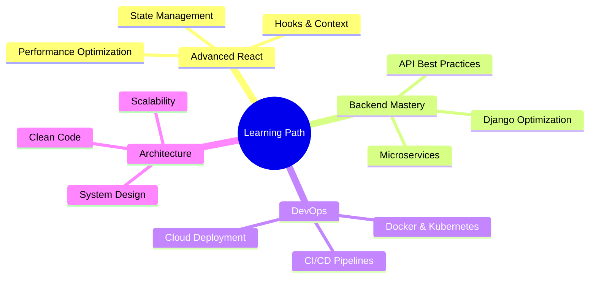

<div align="center">

# 👋 Hello, I'm Amina Shameer

### Full Stack Developer | Python & JavaScript Enthusiast | Building Digital Experiences

[](https://www.linkedin.com/in/amina-shameer32)
[](https://github.com/amina-s232)
[](mailto:aminashameer232@gmail.com)
[](#)


</div>

---

## 🚀 About Me

```python
class FullStackDeveloper:
    def __init__(self):
        self.name = "Amina Shameer"
        self.role = "Python Full Stack Developer"
        self.location = "Bangalore, India"
        self.workspace = {
            "backend": ["Python", "Django", "REST API"],
            "frontend": ["React", "JavaScript", "Tailwind CSS"],
            "database": ["PostgreSQL", "MySQL", "SQLite"],
            "tools": ["Git", "Postman", "JWT"]
        }
        self.mindset = "Continuously learning and evolving"
    
    def current_focus(self):
        return [
            "Building scalable web applications",
            "Crafting seamless user experiences",
            "Mastering cloud deployment",
            "Contributing to open source"
        ]
    
    def say_hi(self):
        print("Thanks for visiting! Let's collaborate and build something amazing! 🚀")

dev = FullStackDeveloper()
dev.say_hi()
```

<div align="center">

### 💡 Passionate about transforming ideas into elegant, functional web solutions

</div>

---

## 🛠️ Technology Arsenal

<div align="center">

### **Languages**


### **Frameworks & Libraries**


### **Databases**


### **Tools & Platforms**


</div>

---

## 💼 What I Do Best

<table>
<tr>
<td width="50%">

### 🎨 Frontend Development
- Building responsive, modern UIs with **React**
- Styling with **Tailwind CSS** & **Bootstrap**
- Creating seamless user experiences
- Implementing interactive components
- Mobile-first design approach

</td>
<td width="50%">

### ⚙️ Backend Development
- Developing robust APIs with **Django REST**
- Database design & optimization
- Authentication & authorization systems
- Server-side logic & business rules
- Performance optimization

</td>
</tr>
</table>

<div align="center">

### 🔐 **Authentication** | 🔌 **API Integration** | 📊 **Database Management** | 🚀 **Deployment**

</div>

---

## 📊 GitHub Analytics

<div align="center">


</div>

<div align="center">


</div>

<div align="center">


</div>

---

## 🏆 Featured Projects

<div align="center">

<table>
<tr>
<td width="50%">

### 📝 [Task Management System](https://github.com/amina-s232)

**Advanced TODO Application with Authentication**

```javascript
Tech: Django | React | PostgreSQL
```

- ✅ Full CRUD operations
- 🔐 Secure user authentication (JWT)
- 📅 Due date tracking & reminders
- 🔍 Advanced search & filtering
- 📱 Responsive design
- 💾 Persistent data storage

**[View Project →](https://github.com/amina-s232)**

</td>
<td width="50%">

### 🎬 [Movie Collection Manager](https://github.com/amina-s232)

**Comprehensive Media Management Platform**

```javascript
Tech: Django | Bootstrap | MySQL
```

- 📋 Complete CRUD functionality
- ⚙️ Custom Django admin panel
- 🎨 Modern, responsive UI
- 🔄 Version controlled with Git
- 📊 Analytics dashboard
- 🌐 RESTful API endpoints

**[View Project →](https://github.com/amina-s232)**

</td>
</tr>
</table>

</div>

---

## 🌱 Current Focus & Learning

<div align="center">



</div>

<table>
<tr>
<td width="33%">

### 🎯 Mastering
- Advanced React patterns
- Redux & Context API
- TypeScript integration

</td>
<td width="33%">

### 🔥 Exploring
- Docker & Containerization
- AWS & Cloud Services
- GraphQL APIs

</td>
<td width="33%">

### 🚀 Planning
- Microservices architecture
- Mobile app development
- Open source contributions

</td>
</tr>
</table>

---

## 🤝 Let's Connect & Collaborate

<div align="center">

### 💬 I'm always excited to discuss new projects, creative ideas, or opportunities!

<br/>

[](https://www.linkedin.com/in/amina-shameer32)
[](mailto:aminashameer232@gmail.com)
[](https://github.com/amina-s232)

<br/>

### 📍 Based in Bangalore, India | 🌏 Available for Remote Opportunities

</div>

---

## 💭 Development Philosophy

<div align="center">

> *"Code is like humor. When you have to explain it, it's bad."* – Cory House

```javascript
const myApproach = {
  code: ['Clean', 'Efficient', 'Scalable', 'Maintainable'],
  mindset: 'Growth-oriented and collaborative',
  passion: 'Building solutions that make a difference',
  belief: 'Continuous learning is the key to staying relevant'
};
```

</div>

---

<div align="center">

### 🎯 Open to Opportunities | 💼 Available for Freelance Projects | 🤝 Open Source Contributor

<br/>


<br/>

### ⭐ "Building the web, one commit at a time" ⭐

<br/>

**© 2024 Amina Shameer. Crafted with 💜 and lots of ☕**

</div>
